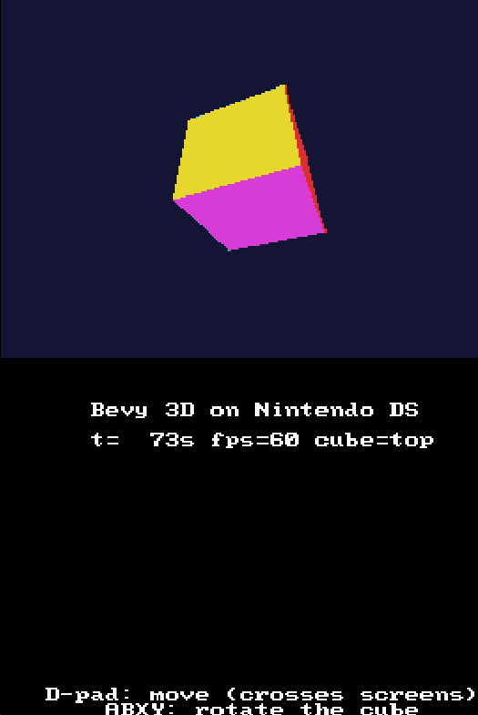

# bevy-ds

[Bevy](https://bevyengine.org/)'s ECS running on a Nintendo DS, built into an
`.nds` ROM that boots in an emulator or on hardware. The build runs entirely
inside a Nix dev shell.

There are several crates:

- **`bevy_nds`** (`crates/bevy_nds`) — the library. It binds Bevy's `no_std`
  ECS/App core to the DS hardware through [libnds](https://github.com/blocksds/libnds)
  and exposes it as Bevy plugins, components and resources.
- **`bevy_nds_3d`** (`crates/bevy_nds_3d`) — an add-on that drives the DS
  hardware 3D engine, with `Transform3d`, `DsMesh`, a `Camera3d` resource,
  view-frustum culling, and model loading (baked or from NitroFS at runtime).
  Depends on `bevy_nds`.
- **`bevy_nds_3d_obj`** (`crates/bevy_nds_3d_obj`) — host-side Wavefront OBJ →
  display-list encoder. The single source of truth for the geometry packing,
  shared by the macro, the converter and the build script.
- **`bevy_nds_3d_macros`** (`crates/bevy_nds_3d_macros`) — the `include_obj!`
  proc-macro, which bakes a model into the ROM binary at compile time.
- **`bevy_nds_3d_cull`** (`crates/bevy_nds_3d_cull`) — pure, host-testable
  view-frustum culling math.
- **`obj2dl`** (`crates/obj2dl`) — host CLI + library that bakes OBJ models into
  `.dl` assets for NitroFS; used by the demo's `build.rs`.
- **`bevy-ds`** (the root crate) — the demo. Plain Bevy components and systems,
  with no FFI, allocator or panic handler.

<p align="center">
  
</p>

The demo renders a hardware-lit Utah teapot on one screen and a text HUD on the
other, with a smaller second teapot spinning beside it (two independent model
matrices composed on the CPU each frame). The D-pad moves the player's teapot,
ABXY rotate it, and moving it off the edge sends it to the other screen. The
models are loaded at runtime from the ROM filesystem (NitroFS), falling back to a
copy baked into the binary if the filesystem is unavailable — the HUD shows which
path was taken.

The screen-crossing follows from the hardware layout: the 3D core is attached to
the main 2D engine, and the `POWER_SWAP_LCDS` bit selects which physical LCD that
engine drives. The sub engine drives the other one. The teapot and the HUD are
therefore always on opposite screens, and a `Display3d` resource controls which
is which. Crossing the edge toggles the bit, swapping both at once.

## How it works

The full `bevy` crate depends on `wgpu` and `winit` and won't run on the DS.
Bevy's core has been `no_std`-capable since 0.16, so `bevy_nds` uses those pieces
and supplies the platform layer itself. DS hardware is mapped onto ordinary Bevy
concepts so game code doesn't deal with it directly:

| DS hardware              | `bevy_nds` exposes                                                    | Plugin              |
| ------------------------ | -------------------------------------------------------------------- | ------------------- |
| Top / bottom LCDs        | `DsScreen::{Top,Bottom}` component + `Consoles` resource             | `VideoPlugin`       |
| Buttons (`REG_KEYINPUT`) | the standard `ButtonInput<DsButton>` resource                        | `InputPlugin`       |
| Vertical-blank @ ~60 Hz  | a `set_runner` frame loop + a real `Time` resource (hardware timer)  | `TimePlugin`        |
| —                        | a smoothed `Fps` resource for diagnostics                            | `DiagnosticsPlugin` |
| Tiled text background    | `Glyph` / `DsText` + `TilePos`, drawn by an extraction system        | `RenderPlugin`      |
| 3D geometry engine       | `Transform3d` + `DsMesh` + a `Camera3d` resource (in `bevy_nds_3d`)  | `Ds3dPlugin`        |

`DsPlugins` bundles all of it, and `bevy_nds::run(app)` installs the runner that
owns the frame loop (`swiWaitForVBlank` → `app.update()`).

### Rendering model

Desktop Bevy extracts entities to the GPU every frame. `bevy_nds` keeps that
shape, but the "GPU" is the DS text console (a tiled background) and the draw
call is a libnds `printf`. A drawable is any entity with a `TilePos` and a
`DsScreen`, plus either a `Glyph` (one character) or a `DsText` (a string).

The renderer is double-buffered at the grid level to avoid flicker. Each screen
keeps a `front` buffer mirroring the live tilemap and a `back` buffer composed
from scratch each frame. The render system stamps every drawable into `back`,
then writes only the changed cells to the hardware and copies them into `front`.
The screen is never blanked, and most frames touch only a few tiles. This avoids
both the flash of a full `consoleClear()` and per-frame allocation.

`bevy_text` (cosmic-text font rasterisation) is too heavy for the DS, so it's
dropped and replaced with this small `no_std` text layer on the tile engine.

This is the same approach
[`bevy_mod_gba`](https://github.com/bushrat011899/bevy_mod_gba) takes for the
Game Boy Advance.

### Bare-metal runtime

`bevy_nds` also provides the pieces a bare-metal Rust program needs
(`crates/bevy_nds/src/runtime.rs`):

- a `#[global_allocator]` on top of newlib's heap (set up by the BlocksDS crt0),
- a `#[panic_handler]`, and
- a `critical-section` impl that toggles the DS interrupt-enable register, which
  is what Bevy's atomics (`portable-atomic`) sit on.

## Prerequisites

- [Nix](https://nixos.org/) with flakes enabled.

The dev shell provides the Rust nightly toolchain, the BlocksDS SDK, `ndstool`,
the melonDS and desmume emulators, and the preview tooling.

BlocksDS comes in as a proper Nix derivation (no `buildFHSEnv`) via
[`pgattic/blocksds-nix`](https://github.com/pgattic/blocksds-nix), which patches
the official toolchain into the Nix store and exports `$BLOCKSDS` /
`$WONDERFUL_TOOLCHAIN`.

## Quick start

```sh
nix develop          # enter the dev shell (first run builds/fetches the toolchain)

just build           # compile the ARM9 ELF (debug)
just rom             # package it into bevy-ds.nds with ndstool
just run             # build + package + launch melonDS
just preview         # build + package + headless desmume screenshot -> preview.png
```

For the smaller, faster build, append `release`, e.g. `just run release`.

### Tasks

| Command                  | Description                                                |
| ------------------------ | ---------------------------------------------------------- |
| `just build`             | Compile the ARM9 ELF (debug).                              |
| `just build-release`     | Compile the ARM9 ELF (release).                            |
| `just rom [profile]`     | Package an ELF into `bevy-ds.nds` (`ndstool`).             |
| `just run [profile]`     | Build, package, and run in **melonDS** (interactive).      |
| `just preview [profile]` | Build, package, boot in **desmume** headlessly and save `preview.png`. Override with `OUT=`, `WAIT=`, `DISP=`. |
| `just check`             | `cargo check`.                                             |
| `just test [filter]`     | Run the `bevy_nds` host-side unit tests (builds for the host triple). |
| `just fmt`               | `cargo fmt`.                                               |
| `just clean`             | Remove build artifacts and the ROM.                        |

### Testing

The hardware-independent logic has unit tests: the render diffing, the
timer-tick→nanoseconds conversion, the FPS smoothing, the button-mask mapping
(`bevy_nds`), the OBJ→display-list packing (`bevy_nds_3d_obj`), and the
view-frustum culling math (`bevy_nds_3d_cull`). They run on the host, not the DS:

```sh
just test          # run all host unit tests
just test render   # run only tests whose name matches "render"
```

The crates are `no_std` only when not under `cfg(test)`, so the test build links
the host `std` and the standard test harness. `just test` compiles for the host
triple and overrides the project's `build-std`/panic settings for that run (see
the `Justfile`). Dependency-free crates test under a plain host target, while
crates that pull in `core`-compiled dependencies need a `std`-from-source build
to avoid a duplicate `core` lang-item clash, so the recipe runs two `cargo test`
invocations. The first run builds `std` and is slow; later runs are fast.
Hardware calls are kept out of the tested functions, so no DS or emulator is
required.

## Project layout

```
flake.nix                       dev shell: Rust nightly + BlocksDS + emulators + preview tools
rust-toolchain.toml             pins nightly + rust-src (for build-std)
armv5te-nintendo-ds.json        custom Tier-3 target spec (ARM946E-S, no_std)
.cargo/config.toml              build-std + target selection
build.rs                        injects libnds/specs/libgcc link args from $BLOCKSDS
Cargo.toml                      workspace root + the `bevy-ds` game binary
src/main.rs                     the game: pure Bevy components + systems (no FFI)
Justfile                        build / rom / run / preview tasks
crates/bevy_nds/                the reusable Bevy <-> Nintendo DS library
  src/lib.rs                      crate root, plugin/component re-exports, run()
  src/ffi.rs                      hand-written FFI to the libnds functions we use
  src/runtime.rs                  allocator, panic handler, critical-section impl
  src/screen.rs                   DsScreen, Consoles, VideoPlugin (both screens)
  src/input.rs                    DsButton + ButtonInput<DsButton> (InputPlugin)
  src/time.rs                     real-time Time from the hardware timer (TimePlugin)
  src/diagnostics.rs              smoothed Fps resource (DiagnosticsPlugin)
  src/render.rs                   Glyph/DsText/TilePos + diffed render system (RenderPlugin)
  src/runner.rs                   the vblank App runner + DsPlugins group
crates/bevy_nds_3d/             hardware 3D backend (Transform3d, DsMesh, Camera3d)
  src/lib.rs                      meshes, culling, NitroFS loading, render system
  src/ffi.rs                      FFI to the geometry engine + NitroFS / file I/O
crates/bevy_nds_3d_obj/         host OBJ -> display-list encoder (shared packing math)
crates/bevy_nds_3d_macros/      include_obj! proc-macro (bakes a model into the ROM)
crates/bevy_nds_3d_cull/        pure, host-testable view-frustum culling math
crates/obj2dl/                  host CLI/lib: OBJ -> .dl NitroFS asset (used by build.rs)
assets/                         uncompiled source models (e.g. teapot.obj)
build/nitrofs/                  compiled .dl assets, packed into the ROM (gitignored)
```

### Asset pipeline

The DS has no asset server: a model is always *bytes at a ROM address*. A single
host-side encoder (`bevy_nds_3d_obj`) turns a Wavefront OBJ into a libnds
**display list** — the exact geometry-engine command block the hardware draws in
one `glCallList` DMA burst, with all fixed-point and normal packing done on the
host. That encoder feeds two delivery paths:

- **Baked into the binary.** `include_obj!("model.obj")` parses the OBJ at
  compile time and embeds a `&'static` display list in the ARM9 binary.
- **Loaded from NitroFS.** The demo's `build.rs` runs `obj2dl` over `assets/*.obj`
  into `build/nitrofs/*.dl`; `just rom` packs that directory into the ROM
  filesystem (`ndstool -d`), and `DsMesh::load("nitro:/model.dl")` reads it at
  runtime (with a cache flush before the DMA). This keeps large models out of
  precious main RAM and lets assets change without relinking.

Both paths produce byte-identical geometry. Build-time options (`center`,
`offset`, `compress` for `VTX_10` vertices) adjust the baked output at no runtime
cost. Meshes carry a local AABB, which the renderer uses for view-frustum culling
(`bevy_nds_3d_cull`), the DS analogue of Bevy's culling.

## Writing a game

A game is a `no_std` binary that adds `DsPlugins`, registers its systems, and
calls `bevy_nds::run`:

```rust
#![no_std]
#![no_main]

use bevy_app::prelude::*;
use bevy_ecs::prelude::*;
use bevy_nds::prelude::*;

#[unsafe(no_mangle)]
pub extern "C" fn main() -> core::ffi::c_int {
    let mut app = App::new();
    app.add_plugins(DsPlugins);
    app.add_systems(Startup, |mut commands: Commands| {
        commands.spawn((DsScreen::Top, TilePos::new(4, 2), DsText::new("Hello, DS!")));
    });
    bevy_nds::run(app)
}
```

`src/main.rs` is the full example: the hardware-lit teapot loaded from NitroFS,
D-pad movement across both screens (the `Display3d` swap), ABXY rotation, and the
HUD.

## Build details

- **Target.** `armv5te-nintendo-ds.json` describes the ARM946E-S core (no std,
  `panic = "abort"`, soft-float). It's Tier 3, so `core`/`alloc` are built from
  source with `-Z build-std` (set in `.cargo/config.toml`).
- **Linking.** `build.rs` reads `$BLOCKSDS` (set by the dev shell) and passes the
  ARM9 crt0/linker script via `-specs=…/ds_arm9.specs`, plus `-lnds9 -lc -lgcc`.
  `libgcc` is required because the BlocksDS specs alias `__sync_synchronize` to a
  helper that lives in it.
- **Atomics.** The DS has no atomic compare-and-swap, so `portable-atomic`
  (pulled in by Bevy) is backed by the `critical-section` impl in
  `crates/bevy_nds/src/runtime.rs`, which disables interrupts around the section.
- **Packaging.** `ndstool` combines the ARM9 ELF with a stock BlocksDS ARM7 core
  (`arm7_minimal.elf`) and the `build/nitrofs` asset directory (`-d`) into the
  final `.nds`.
- **Performance.** The dev profile leaves the *game* crate unoptimized for fast
  rebuilds but compiles every dependency *and* our engine subcrates at
  `opt-level = 3` (they sit on the per-frame hot path), so the debug ROM runs at
  60 fps on the 33 MHz ARM9. Build `release` for the smallest, fastest ROM.

## Limitations / next steps

- Text rendering goes through the libnds text console. Sprite/tile graphics
  would use libnds OAM/backgrounds (and `grit` for asset conversion, already in
  the shell) behind the same `RenderPlugin` extraction model.
- No audio (maxmod) or Wi-Fi (dswifi). Swap in the matching ARM7 core and link
  `-lmm9` / `-ldswifi9` to enable them.
- Keep entity counts modest; the DS has ~4 MB of RAM.

## References

- BlocksDS SDK — https://github.com/blocksds/sdk
- blocksds-nix (Nix packaging) — https://github.com/pgattic/blocksds-nix
- nds-rs (libnds Rust bindings / target spec reference) — https://github.com/BlueTheDuck/nds-rs
- Bevy `no_std` docs — https://github.com/bevyengine/bevy/blob/main/docs/cargo_features.md
